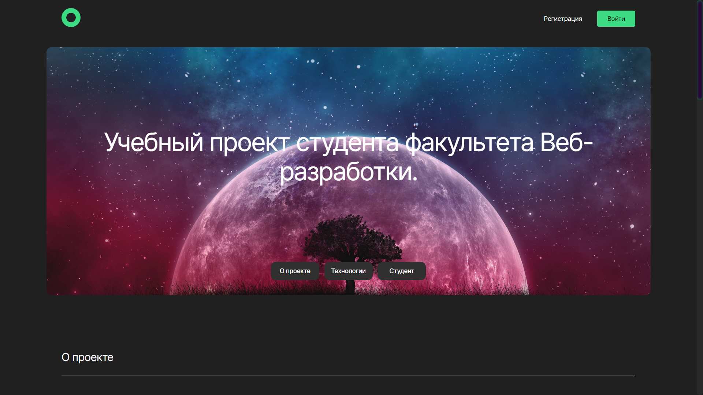
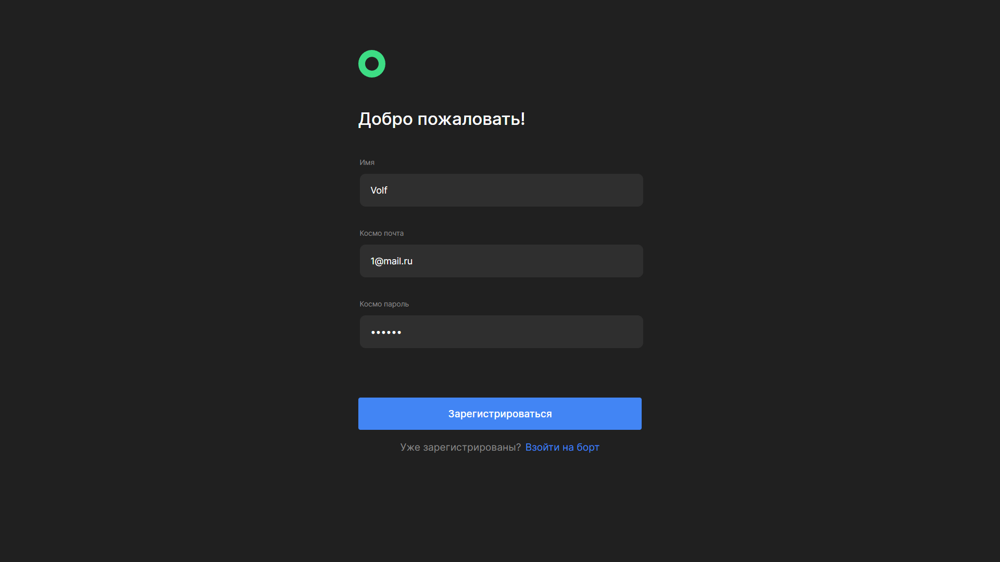
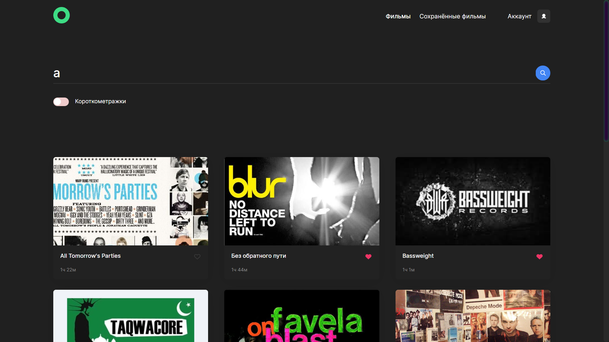
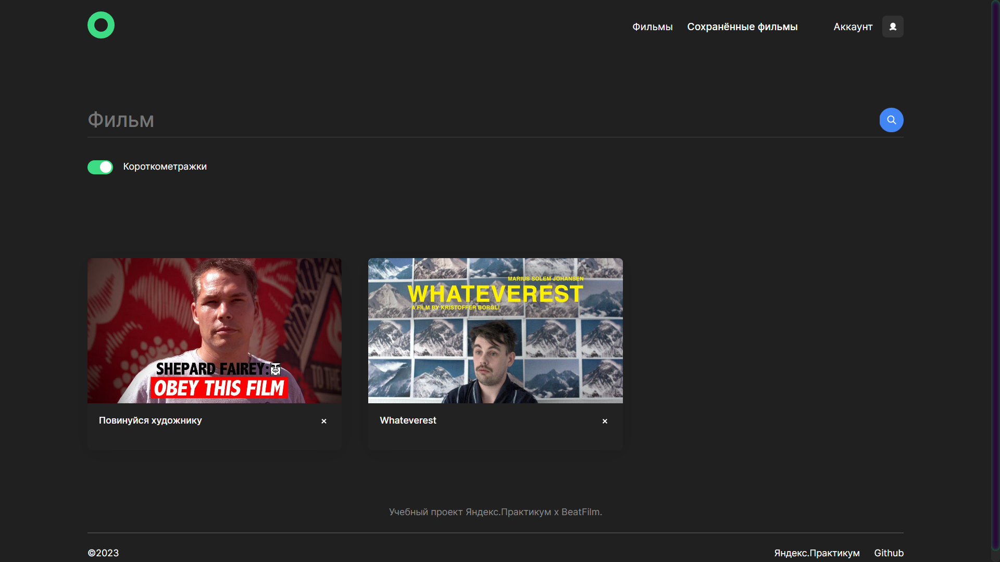
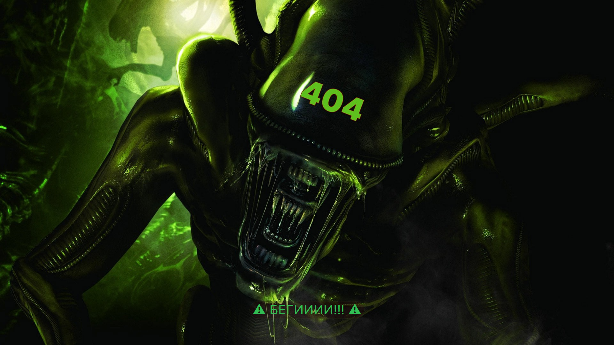

# movies-explorer-frontend
## level - 3

---
## Description
### Functionality: The project allows the user to get acquainted with unusual, interesting films, save them to his list, watch the trailer, search for movies by keywords.

### Technology stack:

- HTML5,
- CSS,
- React js,
- Node js,
- MongoDB,
- Express js,
- PM2.

---

## Project preview

### Start page

  

### Authorization page

  

### Registration page

  

### Movie search page

  

### ### Saved movies search page with filter

  

### Page 404

  

---

## Requirements, installation and launch:

### Requirements:

* npm >= 6.14;

* Node js

* MongoDB

### Installation:

To install on your computer, you need to run the command on your local computer:

- `git clone https://github.com/ChernoSlava/movies-explorer-frontend ` - To copy the project to a local PC over https;

After that, in the console, you need to run:

- `npm install` - To install dependencies;

To use:

- `npm run start' - Command to start the project;
- `npm run build' - To build the project;
------ 
## Links to this project
### Project layout https://disk .yandex.ru/d/69oaThBQQpratA
---
### Public IP - 158.160.58.195
### Domain with an available application [https://movies.chernoslava.nomoredomainsclub.ru ](https://movies.chernoslava.nomoredomainsclub.ru )
### Domain with the application server [https://api.movies.chernoslava.nomoredomains.club](https://api.movies.chernoslava.nomoredomains.club )
---
### Link to github frontend part [Github](https://github.com/ChernoSlava/movies-explorer-frontend )
### Link to github backend part [Github](https://github.com/ChernoSlava/movies-explorer-api )

---

## Links to other projects
### Projects created during Yandex training.Workshop:

1) [Static website Travel to Russia](https://github.com/ChernoSlava/Russian-travel);
2) [The project repository is a place on pure js](https://github.com/ChernoSlava/Mesto);
3) [Repository of a full-fledged modified project, Frontend and Backend location](https://github.com/ChernoSlava/react-mesto-api-full);
4) [Graduation project Movies explorer](https://github.com/ChernoSlava/movies-explorer-frontend).

### Projects created with the training and mentoring of senior web developer Abretova A.:

1) [Counter](https://github.com/ChernoSlava/counter);
2) [Counter-temperature](https://github.com/ChernoSlava/counter-temperature);
3) [ToDo list](https://github.com/ChernoSlava/ToDo);
4) [Contacts keeper](https://github.com/ChernoSlava/contacts-keeper);
4) [Fish gallery](https://github.com/ChernoSlava/fish-gallery);
5) [Refactoring of the Movies explorer graduation project](https://github.com/ChernoSlava/Movies-exlorer-refactor ).

### Projects using different technologies:

1) [Dihitals clock using SCSS/jQuery](https://github.com/ChernoSlava/Digital-Clock.git);
2) [Films review using PUG/SCSS](https://github.com/ChernoSlava/Film-Review );
3) [2d game on Vanila JavaScript/Canvas](https://github.com/ChernoSlava/Fluppy );
4) [React/Next js burger website](https://github.com/ChernoSlava/Burgers-Next-JS ).
